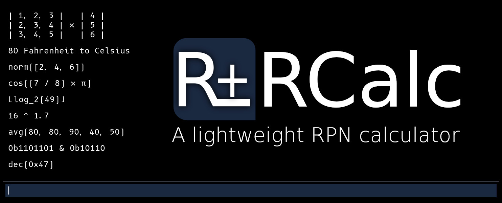

# RCalc

<p align="center">
    <picture>
        <source
            srcset="docs/images/header-light.jpg"
            media="(prefers-color-scheme: light), (prefers-color-scheme: no-preference)"
        />
        <source
            srcset="docs/images/header.jpg"
            media="(prefers-color-scheme: dark)"
        />
        
    </picture>
</p>

RCalc is an RPN ([Reverse Polish Notation](https://en.wikipedia.org/wiki/Reverse_Polish_notation)) calculator written in C++.
It aims to be quick to open and use, and easy to extend with new types, operators, and commands.

| [Features](#features) | [Install](#install) | [Usage](#usage) | [Build](#build) | [Future Plans](#future-plans) | [Contribute](#contribute) |
| :-: | :-: | :-: | :-: | :-: | :-: |

## Features

### RPN Stack

Work quickly and efficiently using the RPN Stack by pushing and popping values. The stack will always show what series
of inputs led to each output, so you won't lose context during complicated expressions.

### Extended Types

RCalc can understand scalar types like integers and real numbers, as well as vectors and square matrices of sizes 2, 3, and 4.
When operating purely in the scalar integer domain, RCalc can promote up to BigInts to avoid floating point imprecision.

### 80 Operators

RCalc has 80 built-in operators with included documentation and examples.
All the expected operators (basic arithmetic, exponents, logarithms) are present, as are:

- Rounding functions (floor/ceil/trunc/round)
- [Unit conversions](#unit-conversions)
- Bitwise operations (and/or/not/xor/shift left/shift right)
- Statistics (avg/min/max/sum/std dev/NPV)
- Trigonometry (sin/cos/tan + arc/hyperbolic variants)
- Vector operations (dot/cross/normalize/length/swizzle)
- Matrix operations (identity/inverse/transpose + translation/scale/rotation matrix generators)

For a complete listing of operators you can see the in-app help menu or the [Operators wiki page](https://github.com/gelvinp/rcalc/wiki/Operators)

### Unit Conversions

RCalc has 74 built-in units, and can convert between units within families, including:

- Angle
- Area
- Colors (3 and 4 components)
- Coordinate systems (2D and 3D)
- Length
- Mass
- Storage (Base 10 [SI, 1000 bytes in a kb] and Base 2 [1024 bytes in a kb])
- Temperature
- Time
- Volume

For a complete listing of units and families, you can see the in-app help menu or the [Units wiki page](https://github.com/gelvinp/rcalc/wiki/Units)

### Value Representation

RCalc recognizes values represented in binary, octal, decimal, and hexidecimal. You can:

- Enter values in one representation, and convert them to another
- See the result of bitwise operations in binary automatically
- View vec3 and vec4 components (truncated) in hexidecimal when working with colors.

### Multi-Platform, Multi-Modal

RCalc runs in a lot of places, in a lot of ways. You can run RCalc on:

- Linux, with a maintained package in the Arch AUR, and a maintained Debian package in development,
- MacOS, with integration into the native menu bar,
- and Windows, either portably or with an installer for a start menu entry.

Additionally, RCalc can run in different modes, either graphically with an ImGui frontend or text-based with a FTXUI frontend.
Use the same familiar calculator on all of your computers, over SSH, and on servers with no display server (when compiled for that purpose).

Finally, RCalc can be used as a component in other software, such as an (in-development) iOS/iPadOS port called SwiftRPN.
If you'd like to join the TestFlight beta for SwiftRPN, feel free to send me a message on Mastodon.

## Install

### Linux

There are two ways to install RCalc on Linux: Standalone and Packaged.

Standalone RCalc is packaged as a single executable which should run on most modern distributions (glibc >= 2.36). These builds can be [downloaded here](https://github.com/gelvinp/rcalc/releases/latest). `RCalc_Linux_Graphical.tar.gz` contains a build which defaults to the graphical interface, but supports the terminal interface with full clipboard support. `RCalc_Linux_TermOnly` contains a build which will run on systems with no display server, only supporting the terminal interface, and with no clipboard support.

Depending on your distro, RCalc may be available *packaged*. Packaged RCalc is installed through your system package manager, and defaults to launching the terminal interface for quick access inside a shell, while including a `.desktop` file for launching the graphical interface from your desktop environment.

| Distro | Instructions |
| ------ | ------------ |
| Arch   | RCalc is available in the AUR, simply install `rcalc` with your preferred AUR helper. |
| Debian | We are investigating a Debian package and/or repository. Please stay tuned for updates. |

### MacOS

RCalc is available as a maintained signed and notarized package for MacOS. [Download it here](https://github.com/gelvinp/rcalc/releases/latest).
It probably supports OSX 10.13 or later for x64 based Macs, and MacOS 11 or later for arm64 (Apple Silicon) based Macs,
however I am unable to test this, so I just have to trust that apple-clang does what I want it to do.

It is possible to access the terminal frontend from a console by creating a shell script somewhere in your path with the following:

```
#!/bin/zsh
/path/to/RCalc.app/Contents/MacOS/rcalc --renderer terminal $@
```

### Windows

RCalc is available on Windows as a portable zip, and as a .msi installer. Both packages contain the same content,
however the installer will also add an entry to the start menu and a shortcut to the desktop.
[Download it here](https://github.com/gelvinp/rcalc/releases/latest).

Due to how Windows works, the package comes with two separate .exe files. `RCalc.exe` is the graphical version, and
`rcalc-console.exe` in the portable package or `console/rcalc.exe` in the installed packge is the text-based console version.

## Usage

RCalc is designed to be simple to use. You can always access help from within RCalc by entering `\help` into the scratchpad,
and if you are using the graphical frontend, you can press F1, navigate to File > Show Help on Linux and Windows, or Help > RCalc Help on Mac OS.

RCalc supports some command line options, which you can view by running RCalc from a terminal with the `--help` flag.
The most important flag is `--renderer`, which allows you to select which frontend to open.

`rcalc --renderer imgui` will open the graphical frontend, while `--renderer terminal` will open the text-based frontend.

## Build

> [!IMPORTANT]  
> This repository makes use of git submodules, it is important to make sure all
> submodules have been initialized or you will not be able to build RCalc.

RCalc is built using SCons (4.4 or later) and Python (3.10 or later).
For specific instructions for each platform, please see the relevant wiki page:

* [Building for Linux](https://github.com/gelvinp/rcalc/wiki/Building-for-Linux)
* [Building for MacOS](https://github.com/gelvinp/rcalc/wiki/Building-for-MacOS)
* [Building for Windows](https://github.com/gelvinp/rcalc/wiki/Building-for-Windows)

## Future Plans

In no particular order:

- Publish iOS version
- Create + publish iPadOS version
- Add representation-aware operator implementations (bitwise ops should preserve the representations of their arguments).
- Add Wayland support for the linux builds (waiting on getting a new computer that can hopefully run wayland).
- Unit / fuzzing tests
- Max stack item count + system for responding to low-mem notifications / interrupting `range` eval.
- Non-static pluggable Logger to be swapped out (Don't interrupt terminal renderer, hide during tests, etc...)

## Contribute

Please see the relevant wiki page for instructions:

- [Adding new assets](https://github.com/gelvinp/rcalc/wiki/Adding-new-assets)
- [Adding new commands](https://github.com/gelvinp/rcalc/wiki/Adding-new-commands)
- [Adding new modules](https://github.com/gelvinp/rcalc/wiki/Adding-new-modules)
- [Adding new operators](https://github.com/gelvinp/rcalc/wiki/Adding-new-operators)
- [Adding new renderers](https://github.com/gelvinp/rcalc/wiki/Adding-new-renderers)
- [Adding new types](https://github.com/gelvinp/rcalc/wiki/Adding-new-types)
- [Adding new units](https://github.com/gelvinp/rcalc/wiki/Adding-new-units)
